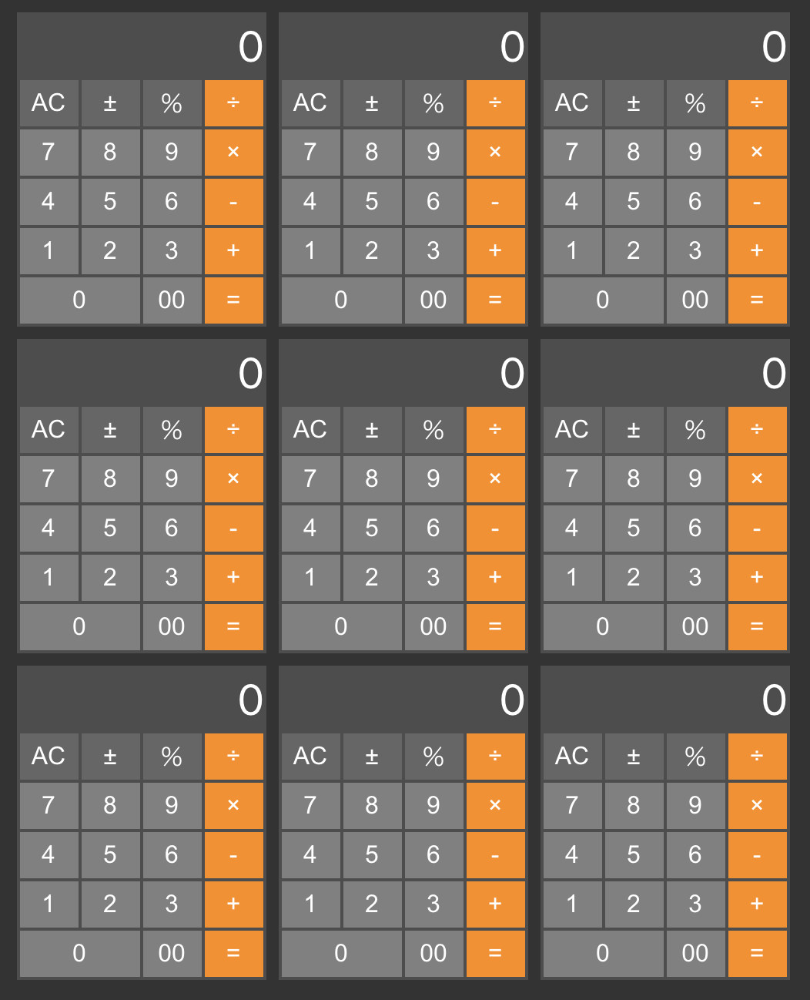

# 電卓アプリ集

電卓アプリ作成を通して各種フレームワークの進化・特徴・混沌を体験する

| Name                  | FW            | 型  | 方法            | 導入             |     |             |
|-----------------------|---------------|-----|-----------------|------------------|-----|-------------|
| react-calc-js-class   | React         |     | Class           | create-react-app |     |             |
| react-calc-ts-class   | React         | TS  | Class           | create-react-app |     |             |
| react-calc-js-hooks   | React >= 16.8 |     | Hooks           | create-react-app |     |             |
| vue-cli-js-option     | Vue 2.x       |     | Options API     | vue init webpack |     | `??` 動かず |
| nuxt4-vue2            | Vue 2.x       |     | Options API     | create-nuxt-app  |     |             |
| ?                     | Vue >= 3.0    |     | Composition API | vue create vite  | WIP |             |
| vite-vue3-options-api | Vue >= 3.2    |     | script setup    | vue create vite  |     |             |
| svelte344-calc-app    | Svelte 3.44.0 | TS? |                 | vue create vite  | WIP | vite 2.9.0  |

## vue-cli-js-option

- `??` 演算子が解釈できない
- 設定ファイルが多すぎる

## nuxt4-vue2

- `??` 演算子の解釈可

### create-nuxt-app

- create-nuxt-app v4.0.0
- Programming language: JavaScript
- Package manager: Npm
- UI framework: None
- Linting tools: None
- Testing framework: Jest
- Rendering mode: Single Page App
- Deployment target: Static (Static/Jamstack hosting)
- Development tools: jsconfig.json
- Continuous integration: None
- Version control system: None
