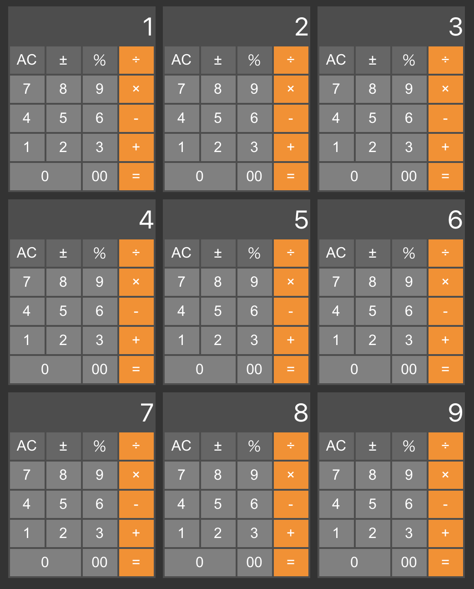

# 電卓アプリ集

電卓アプリ作成を通して各種フレームワークの進化・特徴・混沌を体験する

|    | Name                        | FW            | 型  | 方法            | 導入             |             |
|----|-----------------------------|---------------|-----|-----------------|------------------|-------------|
| × | react-class-js              | React         |     | Class           | create-react-app |             |
| × | react-class-tsx             | React         | TS  | Class           | create-react-app |             |
| ○ | react-hooks-js              | React >= 16.8 |     | Hooks           | create-react-app |             |
| △ | vue2-options-api            | Vue 2.x       |     | Options API     | vue init webpack | `??` 動かず |
| △ | nuxt4-vue2                  | Vue 2.x       |     | Options API     | create-nuxt-app  |             |
| × | vue3-composition-return-api | Vue >= 3.0    |     | Composition API | vue create vite  |             |
| ◎ | vue3-composition-setup-api  | Vue >= 3.2    |     | script setup    | vue create vite  |             |
| ☆ | svelte-simple-js            | Svelte 3.44.0 | TS? |                 | vue create vite  | vite 2.9.0  |

## react-class-js

- 変数を即時更新できない(致命傷)
- watch は componentDidMount と componentDidUpdate の定義(微妙)
- computed 相当がない？

## react-class-tsx

- react-class-js を TypeScript で動くようにしたもの

## react-hooks-js

- 変数を即時更新できない(致命傷)
- useEffect で watch 相当になる
- 単に変数に入れれば computed 相当になる
- this が不要になった

## vue2-options-api

- 変数は即時更新できる
- `??` 演算子でエラー
  - babel 関連が古い？
- 設定ファイルが多すぎ
- 本家から非推奨のお達し

## nuxt4-vue2

- コンポーネントの内容は vue2-options-api とほぼ同じ
- `??` 演算子が動く

## vue3-composition-return-api

- 長所
  - 変数は即時更新できる
  - this が不要になった

- 短所
  - .value だらけ
  - コンポーネントは components に登録しないといけない
  - 何から何まで最後に return で返すのは二度手間
  - しかも宣言から遠すぎて登録を忘れる

## vue3-composition-setup-api

- vue3-composition-return-api のストレスがかなり軽減された
- コンポーネントはインポートするだけで使えるようになった
- 最後に return で返す必要なくなった

## svelte-simple-js

- 変数は即時更新できる
- Emacs 用には svelte-mode.el が対応している
- しかも何の問題もなく全体インデントが効く
- 一番普通に書ける
- .svelteファイルはHTMLのサブセット

